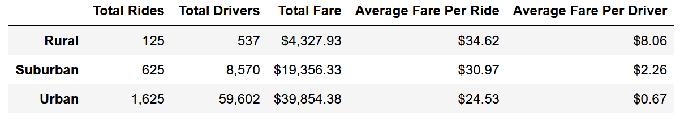

# Matplotlib-Challenge-5

## Overview of the analysis:
The purpose of this analysis was to look into the amount of fares per ride across three different city settings, namely rural, urban, and suburban settings. Rides data as well as city data were saved in two different CSV files and were retreived and merged into a single data frame for the purpose of this analysis. Average ride fare per city type per driver were calculated and plotted into a line chart to provide a better sense of the results.
## Results: 

Looking at the line chart below, we notice a clear and distinct difference in the ride fares by city type. Apparently, ride fares in urban setting tends to be the highest across the board throughout the timeline specified in the analysis. Following urban setteing, we find that suburban setting tends to have lower fare per ride than the urban but still higher than rural. We conclude that ride fares in rural setting is the lowest throughout the time this data was collected (see the table above).
## Summary: Based on the results, provide three business recommendations to the CEO for addressing any disparities among the city types.
